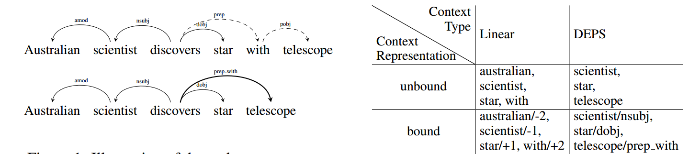

Where to get data?
==================

.. currentmodule:: vecto

This page lists some source corpora and pre-trained word vectors you can download.

Source corpora
--------------

English Wikipedia, August 2013 dump, pre-processed

* `One-sentence per line, cleaned from punctuation <https://my.pcloud.com/publink/show?code=XZKxYV7ZIl9KNR5oLa5K2OMQlVuW1XJ1IV0V>`_

* `One-word-per-line, parser tokenization <https://my.pcloud.com/publink/show?code=XZYcQV7ZR67964yEkEJhgHaM273JjptIUEpX>`_ (this is the version used in the non-dependency-parsed embeddings downloadable below, so use this one if you would like to have directly comparable embeddings)

* `Dependency-parsed version (CoreNLP Stanford parser) <https://my.pcloud.com/publink/show?code=XZ1nbV7ZTdOs3qzO6p7X3lzX7Ychmbqc2unX>`_

Pre-trained VSMs
----------------

**English**

Wikipedia vectors (dump of August 2013)

Here you can download 500-dimensional pre-trained vectors for the popular `CBOW, Skip-Gram <https://arxiv.org/pdf/1301.3781.pdf>`_ and `GloVe <https://www.aclweb.org/anthology/D14-1162>`_ VSMs - each in 4 kinds of context:

These embeddings were generated for `the following paper <http://www.aclweb.org/anthology/D17-1256>`_. Please cite it if you use them in your research:

::

 @inproceedings{LiLiuEtAl_2017_Investigating_Different_Syntactic_Context_Types_and_Context_Representations_for_Learning_Word_Embeddings,
  title = {Investigating {{Different Syntactic Context Types}} and {{Context Representations}} for {{Learning Word Embeddings}}},
  url = {http://www.aclweb.org/anthology/D17-1256},
  booktitle = {Proceedings of the 2017 {{Conference}} on {{Empirical Methods}} in {{Natural Language Processing}}},
  author = {Li, Bofang and Liu, Tao and Zhao, Zhe and Tang, Buzhou and Drozd, Aleksandr and Rogers, Anna and Du, Xiaoyong},
  year = {2017},
  pages = {2411--2421}}

You can also `download the source corpus <https://my.pcloud.com/publink/show?code=XZYcQV7ZR67964yEkEJhgHaM273JjptIUEpX>`_ (one-word-per-line format) with which you can train other VSMs for fair comparison.

Each of the 3 models (CBOW, GloVe and Skip-Gram) is available in 5 sizes (25, 50, 100, 250, and 500 dimensions) and in 4 types of context: the traditional word linear context (which is used the most often), the `dependency-based structured context <http://www.aclweb.org/anthology/P14-2050>`_, and also less common structured linear and word dependency context.

**Unbound linear context** (aka *word linear context*)

*500 dimensions:* `word_linear_cbow_500d <https://my.pcloud.com/publink/show?code=XZ7oQV7ZtOKVArr2oo43sGneJ97PA0XAwus7>`_, `word_linear_sg_500d <https://my.pcloud.com/publink/show?code=XZ5oQV7ZAQf36xu0bCkSOS6T44MoFYJfw00k>`_, `word_linear_glove_500d <https://my.pcloud.com/publink/show?code=XZXoQV7ZpTzLwpqdLyzPfwnT7Fcv55E3Fe3V>`_

*250 dimensions:* `word_linear_cbow_250d <https://my.pcloud.com/publink/show?code=XZulYV7ZisQrET4XHTHMcy8fz2kkg4Sf18Ry>`_, `word_linear_sg_250d <https://my.pcloud.com/publink/show?code=XZKlYV7ZKMBIOldSJo8Fk40gqkttkX2zNzz7>`_, `word_linear_glove_250d <https://my.pcloud.com/publink/show?code=XZglYV7Z9AyDD0Y03RQ41sFQc41g0SXCdIpy>`_

*100 dimensions:* `word_linear_cbow_100d <https://my.pcloud.com/publink/show?code=XZhlYV7ZcDdiVOs5tTkroT5h7bmGFFz17X5k>`_, `word_linear_sg_100d <https://my.pcloud.com/publink/show?code=XZwlYV7ZI8WPcaXm7OmUQ4QYhbFvk4BEYzaX>`_, `word_linear_glove_100d <https://my.pcloud.com/publink/show?code=XZ9lYV7ZH1yzsyHlQSRWYEhfQgKfM872Em0X>`_

*50 dimensions:* `word_linear_cbow_50d <https://my.pcloud.com/publink/show?code=XZmlYV7ZdvK04WSDjG4Kz51ohUQFPJLrPWV7>`_, `word_linear_sg_50d <https://my.pcloud.com/publink/show?code=XZxlYV7Zo2C4QlI9xDfTTur15Qxgekkvp7lX>`_, `word_linear_glove_50d <https://my.pcloud.com/publink/show?code=XZ1lYV7ZRM85JnliynpAbhkaQc6GVmOoBn6X>`_

*25 dimensions:* `word_linear_cbow_25d <https://my.pcloud.com/publink/show?code=XZYlYV7ZwGMYTVssGmSNVNS93AMYRBafIQO7>`_, `word_linear_sg_25d <https://my.pcloud.com/publink/show?code=XZPlYV7ZPqBg6CX2KXJa80Egqkqht47VCOKk>`_, `word_linear_glove_25d <https://my.pcloud.com/publink/show?code=XZslYV7ZHmkNLyF6UL8xE2GEFLtQSuHqxcKk>`_

**Unbound dependency context** (aka *word dependency context*)

*500 dimensions:* `word_deps_CBOW_500d <https://my.pcloud.com/publink/show?code=XZacQV7ZUOWcmOufhL4iplh89volJJsgVhF7>`_, `word_deps_sg_500d <https://my.pcloud.com/publink/show?code=XZccQV7ZnBNANKrYz9fKh0nnU8OSX7YVhkR7>`_, `word_deps_glove_500d <https://my.pcloud.com/publink/show?code=XZicQV7ZhuzDUY6drr4ARqreHxkfXhkhkg27>`_

*250 dimensions:* `word_deps_cbow_250d <https://my.pcloud.com/publink/show?code=XZvKYV7ZQuceFLhGUWQ6PyesIBIsEVSQXam7>`_, `word_deps_sg_250d <https://my.pcloud.com/publink/show?code=XZLlYV7ZEQEdoHEie5BuqrdPY01VGmCUsobX>`_, `word_deps_glove_250d <https://my.pcloud.com/publink/show?code=XZ5lYV7ZYBbEVfCxWM0Ai3Ti9IcIQpf6L8T7>`_

*100 dimensions:* `word_deps_cbow_100d <https://my.pcloud.com/publink/show?code=XZ3KYV7ZEnbKOV4fIiLoem4j1zF9q7tjkBGX>`_, `word_deps_sg_100d <https://my.pcloud.com/publink/show?code=XZHlYV7ZhTD8XY4gB27kOk65aLv9LbY7Bnjy>`_, `word_deps_glove_100d <https://my.pcloud.com/publink/show?code=XZVlYV7ZN5Pm7ezpk3yCz20TUSuambysdP9k>`_

*50 dimensions:* `word_deps_cbow_50d <https://my.pcloud.com/publink/show?code=XZOKYV7ZdFuIfLbjHkf7E8h3b3HPwzuGGM1X>`_, `word_deps_sg_50d <https://my.pcloud.com/publink/show?code=XZplYV7ZVzca9TCA8WY3SL99PhtBK8n1JoSk>`_, `word_deps_glove_50d <https://my.pcloud.com/publink/show?code=XZ7lYV7ZjKd9VrRm78QDp57So3zRfYfVaQcV>`_

*25 dimensions:* `word_deps_cbow_25d <https://my.pcloud.com/publink/show?code=XZqKYV7ZS10yWbGyzR8zEQ3VGP9p54FDyohy>`_, `word_deps_sg_25d <https://my.pcloud.com/publink/show?code=XZJlYV7Zs4JlIKbUtLQQFMiQmMOII7QXseD7>`_, `word_deps_glove_25d <https://my.pcloud.com/publink/show?code=XZrKYV7ZOmhjV47u8lHyJzuhOiEDm8JBkyhk>`_

**Bound linear context** (aka *structured linear context*)

*500 dimensions:* `structured_linear_cbow_500d <https://my.pcloud.com/publink/show?code=XZKcQV7ZusfRm99TPSkdpqpjN4c9QkDQvYHX>`_, `structured_linear_sg_500d <https://my.pcloud.com/publink/show?code=XZEcQV7ZRXITvejfSV5MIHOkzEGkpm08BcNX>`_, `structured_linear_glove_500d <https://my.pcloud.com/publink/show?code=XZtcQV7ZEaxc9WkUEzFyWlABJfvvEhsVtuj7>`_

*250 dimensions:* `structured_linear_cbow_250d <https://my.pcloud.com/publink/show?code=XZHKYV7ZQbPqGclTkQXCnucpQYNaepFdwtUV>`_, `structured_linear_sg_250d <https://my.pcloud.com/publink/show?code=XZxKYV7ZqYBiWKbcBAYicNXRQKvu7LAiC1Qy>`_, `structured_linear_glove_250d <https://my.pcloud.com/publink/show?code=XZjKYV7ZpOGtYDuNU00knopKpXIny7qsTaly>`_

*100 dimensions:* `structured_linear_cbow_100d <https://my.pcloud.com/publink/show?code=XZFKYV7ZBNi8fkrGIXY0Yh7tOkTX7uuqMxgy>`_, `structured_linear_sg_100d <https://my.pcloud.com/publink/show?code=XZTKYV7ZBVGh0vLavyQYmbVROV2QK7ziPDCy>`_, `structured_linear_glove_100d <https://my.pcloud.com/publink/show?code=XZmKYV7Zgyyapidca28dhoHVKHu0y5LypQTk>`_

*50 dimensions:* `structured_linear_cbow_50d <https://my.pcloud.com/publink/show?code=XZXKYV7ZzjgJFvDJKOh4QzwOrf3kIhgY9Qik>`_, `structured_linear_sg_50d <https://my.pcloud.com/publink/show?code=XZsKYV7Zc6y8l11aXehBTJfaVwTmIu5Bbfvk>`_, `structured_linear_glove_50d <https://my.pcloud.com/publink/show?code=XZQKYV7ZP7ICg5OiehyxACPpAUF0lpQYyR5y>`_

*25 dimensions:* `structured_linear_cbow_25d <https://my.pcloud.com/publink/show?code=XZcwYV7ZNf6k7YwqV8FQ3jEl6Fdjz0Xl4myy>`_, `structured_linear_sg_25d <https://my.pcloud.com/publink/show?code=XZBKYV7ZnAm5dmhjkDQpQUeMYBCQGpYqveFy>`_, `structured_linear_glove_25d <https://my.pcloud.com/publink/show?code=XZ8KYV7Zsk1Vq1eyA8p4r330FPYokVxIyBtk>`_

**Bound dependency context** (aka *structured dependency context*)

*500 dimensions:* `structured_deps_cbow_500d <https://my.pcloud.com/publink/show?code=XZDcQV7ZQfLM3T3jydX9w2aJr7UldFEDWS4V>`_, `structured_deps_sg_500d <https://my.pcloud.com/publink/show?code=XZgcQV7ZfzzuQjOKCxkcOfrHj8Yemfv2WyXy>`_, `structured_deps_glove_500d <https://my.pcloud.com/publink/show?code=XZ9cQV7ZuRvd5fFmnxm11cug3ewruuPO5Aa7>`_

*250 dimensions:* `structured_deps_cbow_250d <https://my.pcloud.com/publink/show?code=XZBwYV7ZWf86nSHBrUjQBSCDBsk5XmyiE9O7>`_, `structured_deps_sg_250d <https://my.pcloud.com/publink/show?code=XZNwYV7ZD0qtDzbbfIFA0tUwafl1GXiWjpBV>`_, `structured_deps_glove_250d <https://my.pcloud.com/publink/show?code=XZgwYV7ZEBJXpPRygNYv3R7YAA7AeRaWHwm7>`_

*100 dimensions:* `structured_deps_cbow_100d <https://my.pcloud.com/publink/show?code=XZuwYV7Z3xL5gAVboKBmWQhlz6un9hVnCD1V>`_, `structured_deps_sg_100d <https://my.pcloud.com/publink/show?code=XZAwYV7ZrjuC5jhpos0ksm5OnR3ORj5E5zby>`_, `structured_deps_glove_100d <https://my.pcloud.com/publink/show?code=XZMwYV7Zjk9mzOu4rXBv0WM9HDCtWmGImjg7>`_

*50 dimensions:* `structured_deps_cbow_50d <https://my.pcloud.com/publink/show?code=XZmwYV7ZNjYCFb1k17Sxf2LFteFziXtcsdxk>`_, `structured_deps_sg_50d <https://my.pcloud.com/publink/show?code=XZOwYV7Zmoh4zfUWb7FTVGvBUpaV7juEQYA7>`_, `structured_deps_glove_50d <https://my.pcloud.com/publink/show?code=XZ1wYV7ZdvXjLnW8l0pgQacOjcd5wV5MU7o7>`_

*25 dimensions:* `structured_deps_cbow_25d <https://my.pcloud.com/publink/show?code=XZpwYV7Zwnf7KxYY3OJjD2ph6L92NH6Ada9X>`_, `structured_deps_sg_25d <https://my.pcloud.com/publink/show?code=XZxwYV7Z4LBXPMEybQ7LLwC6VqIUaQqsg17X>`_, `structured_deps_glove_25d <https://my.pcloud.com/publink/show?code=XZswYV7Zi24SStfrHeJsUftzr6lzUHG2smcX>`_

The training parameters are as follows: window 2, negative sampling size is set to 5 for SG and 2 for CBOW. Distribution smoothing is set to 0.75. No dynamic context or "dirty" sub-sampling. The number of iterations is set to 2, 5 and 30 for SG, CBOW and GloVe respectively.

SVD vectors:

:BNC, 100M words:   window 2, 500 dims, PMI; SVD C=0.6, 318 Mb, `mirror <https://s3.amazonaws.com/blackbirdprojects/tut_vsm/vectors/explicit_BNC_w2_m10_svd_500_C0.6.tar.gz>`__

**Russian**

:Araneum+Wiki+Proza.ru, 6B words:   window 2, 500 dims, PMI; SVD C=0.6, 2.3 Gb, `mirror <https://s3.amazonaws.com/blackbirdprojects/tut_vsm/vectors/explicit_GIGA_Wiki_proza_RUS_w2_m10_svd_500_C0.6.tar.gz>`__, `paper to cite <https://www.researchgate.net/profile/Aleksandr_Drozd/publication/282314408_Discovering_Aspectual_Classes_of_Russian_Verbs_in_Untagged_Large_Corpora/links/560b85a408ae576ce6411bfb.pdf>`_

::

   @inproceedings{7396482,
   author={A. Drozd and A. Gladkova and S. Matsuoka},
   booktitle={2015 IEEE International Conference on Data Science and Data Intensive Systems},
   title={Discovering Aspectual Classes of Russian Verbs in Untagged Large Corpora},
   year={2015},
   pages={61-68},
   doi={10.1109/DSDIS.2015.30},
   month={Dec}}
