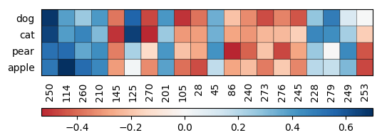
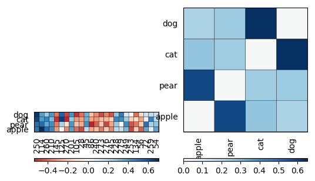
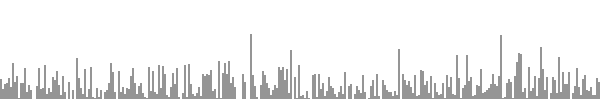
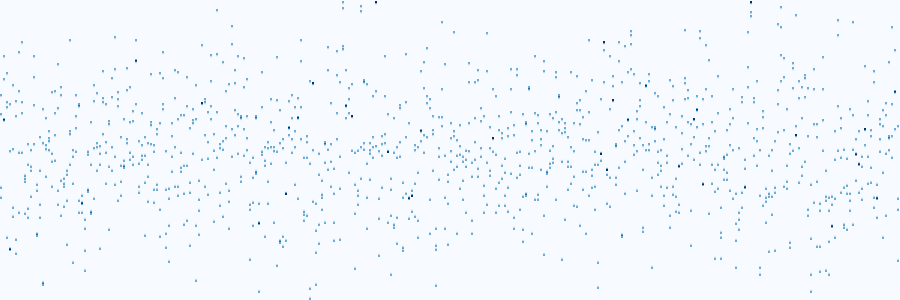

Visualization
=============

.. currentmodule:: vecto

When you have the numerical vectors for the units you are interested in, you can use all the goodies of matplotlib to create any kind of visualizaion you like. The visualize module of Vecto provides a few simple examples to get you started and/or quickly explore your model as you go.

The `visualize` module of vecto comes with several functions to quickly explore the representations.

Drawing features
----------------

>>> from vecto import visualize as vz
>>> vs.draw_features(vsm, ["apple", "pear", "cat", "dog"], num_features=20)

TODO: how to interpret this.

Visualizing similarity between certain words.
---------------------------------------------

>>> vs.draw_features_and_similarity(vsm, ["apple", "pear", "cat", "dog"])

The color intensity indicates the degre of similarity. We can see that apple is more similar to pear than to cat or dog, and the other way round.

Visualizing dimensions
----------------------

In a dense VSM, each dimension on its own is `not likely to be an interpretable semantic feature on its own <http%3A%2F%2Fwww.aclweb.org%2Fanthology%2FW16-2507&usg=AOvVaw05u2poEJDhTWcWk19t5HLE>`_. Still, it is the overall pattern of the dimensios that encodes the meaning of any given language unit, and so it may be useful to visually inspect them.

>>> vs.std_to_img(vsm.get_row("apple"))

.. image:: images/std_to_img.png

>>> vs.std_to_img(vsm.get_row("cat"))

The `rows_to_img` function displays only the end points of all dimensions in a given collection of vectors.

>>> vectors = vs.wordlist_to_rows(vsm, ["apple", "pear", "cat", "dog"])
>>> vs.rows_to_img_tips(vectors,max_y=0.8)

